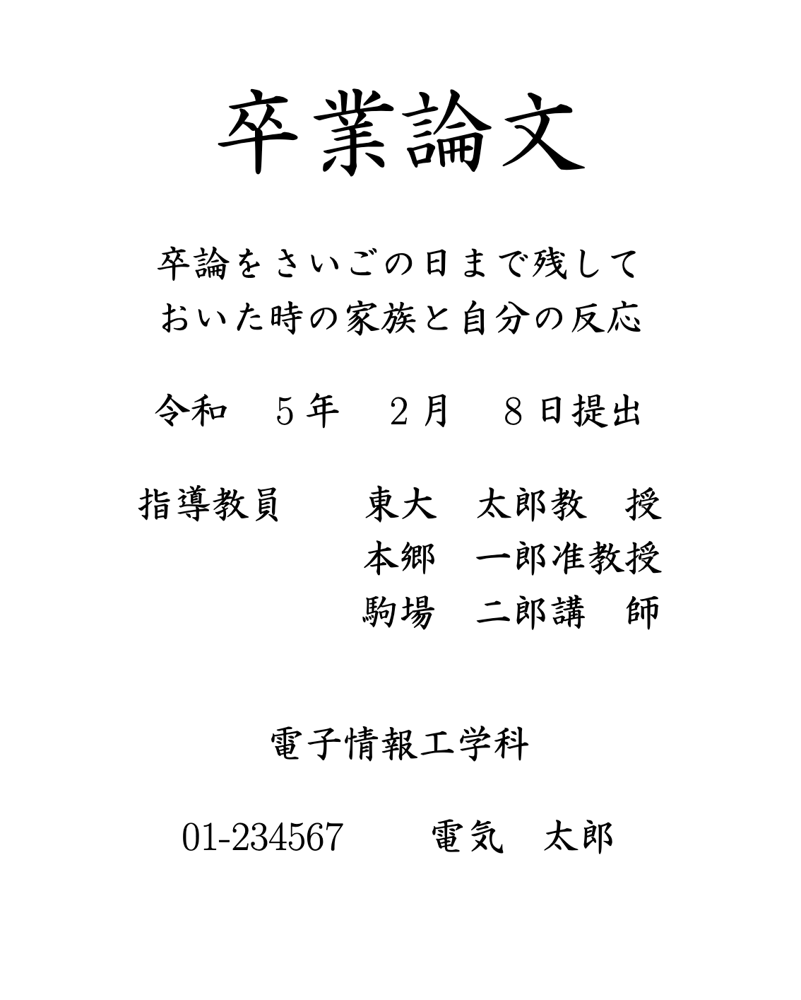

東京大学の電気系学科の卒業/修士/博士論文の表紙っぽい表紙を作成するパッケージです。非公式非公認です。

## Requirements
フォントの都合上`luatexja-fontspec`を使用しているのでLuaTeXでないと動きません。

## フォントについて
HGSeikaishotaiPROというフォントが必要です。残念ながらMacやOverleafのデフォルトフォントではありません。

このフォントはWindowsにOffice365をインストールすると`C:\Windows\Fonts`にダウンロードされるので、私は学科PCにOfficeを入れてからフォントをMacに移植しました。

#### フォントをインストールした場合
`\titlepagefont{HGSeikaishotaiPRO}`と書いてフォントを指定してください(例を参照)。

#### フォントをインストールしていない場合(Overleaf等)
フォントファイルを`.tex`ファイルと同じディレクトリに配置し、`\titlepagefont{[フォント名.TTF]}`でフォントを指定してください(例を参照)。


## 使い方
`eeictitlepage.sty`を`.tex`と同じディレクトリに置きます。
`\author`などで内容を指定します。
`document`内に`\mytitlepage`と書くと表紙が生成されます。

## 例
##### コード
```tex
\documentclass{ltjsarticle}
\usepackage{luatexja}

\usepackage{eeictitlepage}

% define ----------
\titlepagefont{[HGRSKP.TTF]} % フォントファイルを配置した場合
% \titlepagefont{HGSeishotaiPRO} % フォントをインストールした場合

\bigtitle{卒業論文}

\title{卒論をさいごの日まで残して\\おいた時の家族と自分の反応}
\date{\formatdate{8}{2}{2023}} % アメリカ式

\professor{東大　太郎}{教　授}
\secondprofessor{本郷　一郎}{准教授} % optional
\thirdprofessor{駒場　二郎}{講　師} % optional

\department{電子情報工学科}
\studentnum{01-234567}
\author{電気　太郎}
% ------------------

\begin{document}

\eeictitlepage % タイトルの挿入

\end{document}
```

##### 出力
