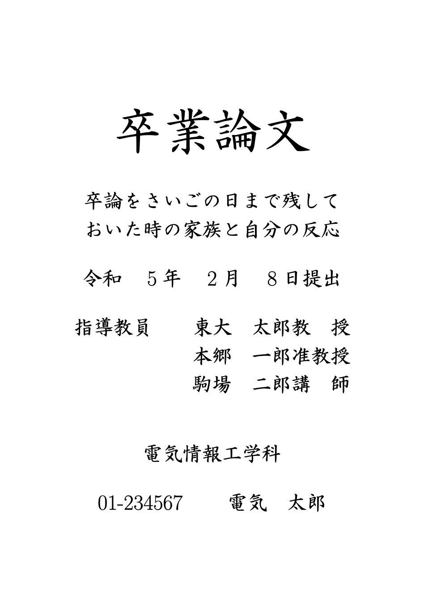

自分用。東京大学工学部電気系学科の卒業/修士/博士論文の表紙を作成するパッケージ。

なお、HGSeikaishotaiPROというフォントが必要。Macにはデフォルトで入っていない。WindowsにOffice365をインストールすると`C:\Windows\Fonts`にダウンロードされるので、私は学科PCにOfficeを入れてからフォントをMacに移植した。

### Requirements
私の環境(`ltjsarticle`)では動作確認済み。`ltjsarticle`を使わない場合はパッケージの`\usepackage{luatexja-fontspec}`を`\usepackage{fontspec}`
に置き換えれば動くはずです(未検証)。

### 使い方
`mytitlepage.sty`を`.tex`と同じディレクトリに置く。
```tex
\documentclass{ltjsarticle}
\usepackage{luatexja}

\usepackage{mytitlepage}

% define ----------
\bigtitle{卒業論文}

\title{卒論をさいごの日まで残して\\おいた時の家族と自分の反応}
\date{\formatdate{8}{2}{2023}} % アメリカ式

\professor{東大　太郎}{教　授}
\secondprofessor{本郷　一郎}{准教授} % optional
\thirdprofessor{駒場　二郎}{講　師} % optional

\department{電気情報工学科}
\studentnum{01-234567}
\author{電気　太郎}
% ------------------

\begin{document}

\mytitlepage % タイトルの挿入

\end{document}
```

### 出力
